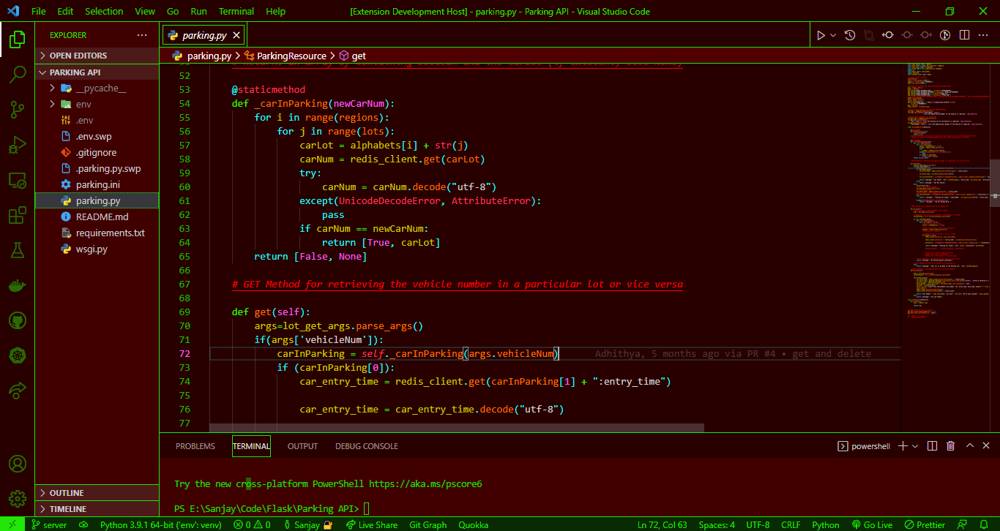

# Rev Blaze High Contrast
## A fiery high contrast colour theme extension for Visual Studio Code

Rev Blaze is a Visual Studio Code colour theme in high contrast that has been consciously developed to aid developers with Deuteranopia colour vision deficiency.

Constant inputs from the visually impaired were taken into account during the development of this colour theme extension.

   
<i>Rev Blaze High Contrast uses the colours Maroon and Lime to offer a superior programming experience.</i>

### Your feedback is important!
If you think this extension is helpful to you, please do let me know. It would motivate me to continue making cool awesome stuff like this. Do leave this extension a review as well.

### Have something to report?
Contact me through
* Email @ revmatcher@sanjaysuresh.com
* My website [sanjaysuresh.com](https://sanjaysuresh.com)

### Version 0.0.2
**Don't follow the path. Blaze the trail!**
